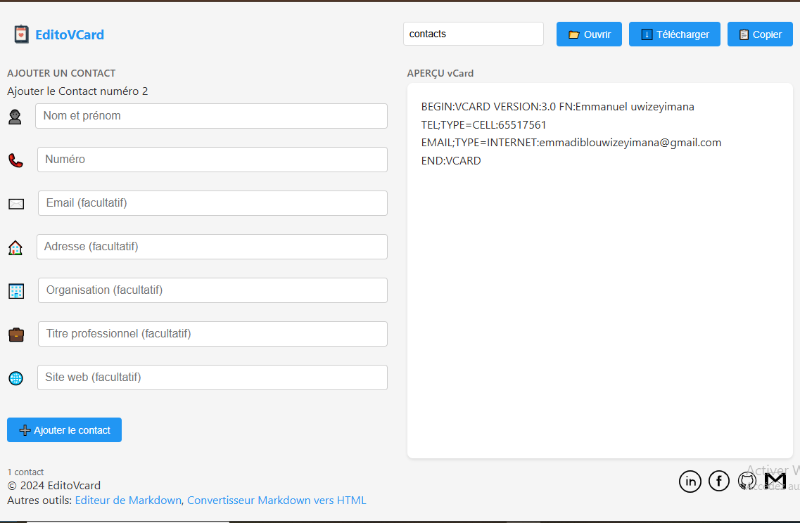

# EditoVCard
Editeur des contacts avec une exportation rapide en .vcf
**EditoVCard** est une application web simple permettant de créer,importer et exporter des fichiers vCard pour gérer vos contacts facilement.

## Fonctionnalités

- **Ajouter un contact** : Ajoutez manuellement des contacts avec leurs informations (nom, numéro, email, etc.).
- **Importer un fichier `.vcf`** : Chargez un fichier vCard existant et éditez-le directement.
- **Exporter les contacts** : Téléchargez vos contacts en fichier vCard au format `.vcf`.
- **Copier les contacts** : Copiez les informations de vos contacts au format vCard dans le presse-papiers.

## Démo

[Voir la démo en ligne](https://emmadiblo.github.io/editovcard/)

---

## Capture d'écran

---

